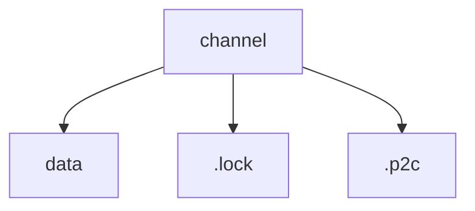
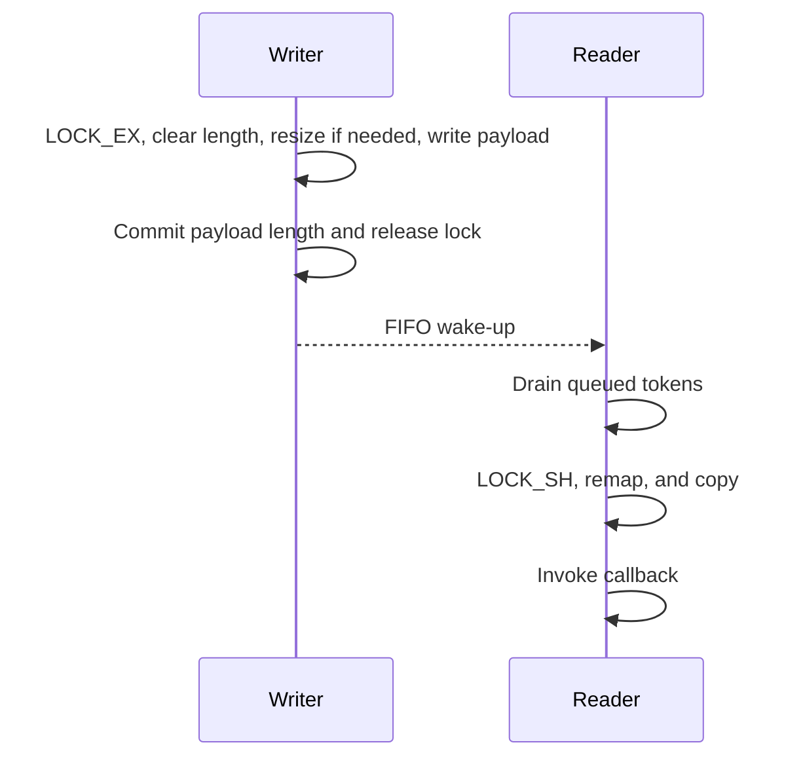

# Latest-Value Shared-Memory Transport

[shm.py](../../../src/dtps_http/shm.py) provides a local, one-producer/one-consumer
transport for the most recent opaque byte payload. It avoids copying a payload
through a socket or message broker: the bytes live in a memory-mapped file,
while a FIFO only wakes the reader after a successful update.

This is a latest-value transport, not a reliable queue. It is intended for a
single `ShmWriter` and a single `ShmReader` on the same host with the required
POSIX capabilities.

It is not zero-copy end to end. A writer copies its input into the mapped
buffer and a reader copies a coherent snapshot out of it. The DTPS integration
also creates a CBOR envelope around each `RawData` value. The benefit is
removing socket or broker delivery from the local data path, not eliminating
all application-level copies.

The transport requires POSIX advisory locks, FIFOs, no-follow file opens, and
positional file I/O. Constructing a writer or reader on a platform that lacks
one of those capabilities raises `OSError` and names the missing capability;
there is no insecure fallback.

Both endpoints must be able to access the same writable channel directory.
For containers, mount that directory into both containers. The immediate
channel directory must be a real directory owned by the current OS user or
root, and it must not be writable by other users. Every existing ancestor is
also checked: it must be owned by the current OS user or root, real rather
than a symlink, and not writable by other users unless it is sticky. This
permits a private directory nested below `/tmp` while preventing an attacker
from replacing path components. Missing directory components are created and
set to `0700` before the next component is created. Either endpoint can start
first. New channel data, lock, and FIFO entries use owner-only `0600`
permissions regardless of the process umask. The default therefore requires
both endpoints to run as the same OS user. Cross-user deployments are not
supported because the channel directory and signal FIFO must remain private to
one account. Do not point a channel path directly into `/tmp` or another
world-writable directory.

## When to Use It

Use SHM for a local stream where only the newest value matters, such as
compressed camera images, rendered previews, high-rate state estimates, or
visualization data. A slow consumer can skip intermediate values and still
recover the latest complete payload.

Do not use it for commands, transactions, event logs, ordered histories,
exactly-once delivery, cross-host delivery, or fan-out to multiple independent
consumers. Use normal DTPS delivery or a queue with the required reliability
contract for those cases.

## Deployment Checklist

1. Use one base channel path for each directed producer-to-consumer stream.
  The writer and reader must resolve their `shm_path` to the same file in the
  shared directory; distinct streams need distinct base paths.
2. For containers, mount the same private directory into both containers. The
  data file alone is insufficient because the `.lock` and `.p2c` artifacts
  are part of the channel.
3. Run endpoints under compatible OS identities. New artifacts are `0600` and
  the channel directory is `0700`, so the usual deployment runs both
  containers as the same UID.
4. Keep one low-level reader or `subscribe(..., shm_only=True)` consumer per
  channel. FIFO bytes are consumed by one reader; they are not broadcast to
  every reader.
5. Treat the directory as private endpoint state. Do not replace, chmod, or
  remove channel artifacts while either endpoint is active.
6. Monitor writer warnings. A failed SHM write can use a publisher's normal
  transport fallback, but an SHM-only subscriber cannot receive that fallback
  message.

## Public API

- `ShmWriter(channel_path, logwarn, logerr)` publishes the latest `bytes`
  payload with `publish(payload)`, clears retained state with `clear()`, and
  releases local resources with `close()`.
- `ShmReader(channel_path, on_payload, logwarn, logerr)` starts delivery with
  `start(deliver_current=True)` and releases local resources with `stop()`.

## DTPS API

`DTPSContext.publish()`, `PublisherInterface.publish()`, and
`DTPSContext.subscribe()` accept these optional keyword arguments:

```python
shm_path: Optional[str] = None
shm_only: bool = False
```

Use them at the DTPS boundary instead of managing `ShmWriter` or `ShmReader`
in application code:

```python
await topic.publish(
  raw_data,
  shm_path="/data/ramdisk/example",
  shm_only=True,
)

subscription = await topic.subscribe(
  on_data,
  shm_path="/data/ramdisk/example",
  shm_only=True,
)
```

The transport choice is local to each call. First identify the normal DTPS
path that the selected API would use without SHM:

| Context and API | Normal publisher or subscriber path |
| --- | --- |
| Remote `DTPSContext.publish()` | One HTTP POST per publication. |
| Remote `PublisherInterface.publish()` returned by `DTPSContext.publisher()` | A persistent WebSocket publisher. |
| Remote `DTPSContext.subscribe(..., inline=True)` | Inline event data over a WebSocket. |
| Create-side `DTPSContext.publish()` or `publisher()` | Direct local object-queue publication. |
| Create-side `DTPSContext.subscribe()` | Direct local object-queue callback. |

`shm_path` and `shm_only` change publisher and subscriber selection
independently.

### Publisher Selection

| `shm_path` | `shm_only` | Behavior |
| --- | --- | --- |
| Empty | `False` | Uses the normal path above. |
| Set | `False` | Attempts an SHM mirror, then always uses the normal path. A mirror failure does not prevent normal delivery. |
| Set | `True` | Attempts SHM first. A successful write suppresses the normal path. An SHM write failure uses the normal path as a fallback. |

The fallback follows the API that made the call: a direct remote
`DTPSContext.publish()` falls back to HTTP POST, a remote publisher object
falls back to its persistent WebSocket, and a create-side context falls back
to its local object queue.

### Subscriber Selection

| `shm_path` | `shm_only` | Behavior |
| --- | --- | --- |
| Empty | `False` | Uses the normal path above. |
| Set | `False` | Still uses only normal DTPS delivery, which prevents duplicate callbacks when a producer mirrors to SHM. |
| Set | `True` | Starts a local SHM reader and does not wait for normal DTPS availability. |

`shm_only=True` requires a nonempty `shm_path`; otherwise the API raises
`ValueError`. An SHM-only subscriber does not receive a publisher's normal
transport fallback after an SHM write failure. If every message must remain
observable during an SHM outage, leave the consumer on normal DTPS delivery or
provide an application-level recovery path.

An SHM-only subscription applies `max_frequency` locally before queueing its
callback. When supplied, it must be a finite positive number; use `None` for
no local rate limit. The `inline` option has no effect because SHM delivery
does not use an event endpoint.

### DTPS SHM Envelope

The low-level channel stores opaque bytes. The DTPS adapter serializes each
`RawData` value as a versioned CBOR mapping containing `version` (currently
`1`), `content` (the original bytes), and `content_type` (the original media
type as text). When it reads a channel published through the DTPS API, a
low-level `ShmReader` receives this envelope rather than the raw application
payload. Conversely,
`subscribe(..., shm_only=True)` accepts only this DTPS envelope; invalid
envelopes are logged and ignored without stopping the subscription.

Context managers reuse writers by channel path and close writers and active
SHM subscriptions during `aclose()`. The returned SHM subscription owns its
reader; call `await subscription.unsubscribe()` when the consumer ends rather
than relying only on manager shutdown.

## Channel Files

Given a channel path such as `/data/ramdisk/dtps/latest-value`, the transport creates three
files:

| Entry | Path | Purpose |
| --- | --- | --- |
| Data | `<channel>` | Mapped bytes. |
| Lock | `<channel>.lock` | Advisory `flock`. |
| Signal | `<channel>.p2c` | Wake-up FIFO. |



The backing file starts with a 16-byte little-endian header:

| Field | Size |
| --- | --- |
| Magic: `DTCM` | 4 B |
| Version | 4 B |
| Capacity | 4 B |
| Payload length | 4 B |
| Payload | Up to capacity |

`payload length == 0` means that no complete payload is currently available.
The writer uses this value while it replaces the payload, and again while it
resizes the backing file.

The `DTCM` marker and version identify the generic payload transport.

The initial capacity is 1 MiB. When necessary, the writer grows the backing
file to at least the requested size, generally by doubling capacity, up to a
64 MiB payload ceiling. A larger low-level payload raises `ValueError`.
Through the DTPS API, that SHM write failure follows the publisher fallback
rules above.

Artifacts persist after `close()` so a later reader can inspect a retained
payload. There is no automatic cleanup API. Once every endpoint has stopped,
an operator may remove the base file, `.lock`, and `.p2c` together to discard
state. Never remove one artifact alone or delete any artifact while another
endpoint might still use the channel.

## Publish and Receive Flow

The lock file is separate from the backing file so resizing cannot invalidate
the inode used for synchronization. The lock is advisory: both endpoints must
use this implementation for the coherent-copy guarantee to apply.



The writer grows the buffer when a payload exceeds its current capacity. It
performs the resize under `LOCK_EX`, resets the payload length to zero, remaps
its buffer, and then publishes the new payload. A reader observes the updated
capacity under `LOCK_SH` and remaps before copying.

## Delivery Semantics

- A delivered payload is coherent: the cooperating writer cannot overwrite it
  while the reader holds its shared lock.
- The newest payload can overwrite an unread payload. There is no per-frame
  acknowledgement or delivery guarantee.
- FIFO tokens are wake-ups, not frame identifiers. The reader coalesces queued
  tokens and then copies the newest complete payload.
- A full FIFO does not block the writer. It drops extra wake-ups because an
  existing queued token will still cause the reader to inspect the latest
  payload.
- Consumers must tolerate dropped payloads and occasional repeated delivery.
- With the default `deliver_current=True`, `start()` delivers a retained
  payload synchronously before it starts the worker. Later callbacks run in
  the daemon worker thread, so callbacks must be safe in both contexts.
- Multiple readers are not supported: they would compete for bytes in the same
  FIFO rather than each receiving every wake-up.

For a DTPS SHM-only subscription, the reader decodes the envelope and schedules
the async user callback on the event loop that created the subscription. A
slow callback fills a positive bounded pending queue; stale pending callbacks
are discarded in favor of the newest value. Callback exceptions are logged and
do not stop the reader or callback processor. This is an additional
latest-value boundary beyond FIFO wake-up coalescing.

The module validates the header and rejects an existing signal path that is not
a FIFO or is a symlink. It also opens data and lock artifacts without following
symlinks, requires each to be a singly linked regular file, and verifies that
after opening its file descriptor. A new or truncated backing file is recreated
under the exclusive lock. A corrupt or incompatible header is also recreated
and emits a warning.

## Lifecycle

`ShmWriter.publish(payload)` creates the channel lazily. Empty payloads are
ignored. `ShmWriter.clear()` removes a retained snapshot but does not wake a
reader or invoke a callback. Use it before a fresh producer session when a
later `start(deliver_current=True)` must not receive retained state. Call
`ShmWriter.close()` when the producer shuts down.

`ShmReader.start()` opens the channel, delivers the current payload when
one already exists, and starts a daemon worker thread. Use
`ShmReader.start(deliver_current=False)` when a fresh consumer session must
ignore the retained payload and drain pending wake-ups before it starts. Call
`ShmReader.stop()` during shutdown. It waits briefly for the worker; if a
callback is still running, the worker releases the mapping, FIFO, and lock file
after that callback returns. A stopped reader can start again after its worker
has exited.

`ShmWriter.close()` and `ShmReader.stop()` release local descriptors and maps;
they do not unlink channel artifacts.

## Minimal Usage

```python
from dtps_http.shm import ShmReader, ShmWriter


def log_message(message: str) -> None:
    print(message)


received = []


def handle_payload(payload: bytes) -> None:
    received.append(payload)


channel_path = "/data/ramdisk/dtps/latest-value"
writer = ShmWriter(channel_path, log_message, log_message)
reader = ShmReader(
    channel_path,
    handle_payload,
    log_message,
    log_message,
)
try:
    writer.publish(b"latest payload")
    reader.start()

    assert received == [b"latest payload"]
finally:
    reader.stop()
    writer.close()
```

## Troubleshooting

| Symptom | Likely cause | Action |
| --- | --- | --- |
| `shm_path is required when shm_only is True` | An SHM-only call omitted its base channel path. | Supply the same nonempty `shm_path` to the intended writer and reader. |
| Unsupported-platform `OSError` | The runtime lacks required POSIX, `fcntl`, FIFO, no-follow, or positional-I/O support. | Run on a POSIX system that exposes every required capability; there is no insecure fallback. |
| Directory, FIFO, symlink, hard-link, or ownership error | The mount, UID, mode, or existing artifacts violate the private-channel contract. | Stop endpoints, inspect all three artifacts and ancestors, correct the mount or ownership, then remove stale artifacts together only when unused. |
| Producer logs `falling back to normal DTPS delivery` | The SHM writer could not encode, open, validate, resize, or write the channel. | Inspect the preceding warning. Direct context publishing uses HTTP, a publisher object uses its WebSocket, and a create-side context uses its local object queue. Normal subscribers can receive the fallback; SHM-only subscribers cannot. |
| SHM-only subscriber starts but receives no data | Paths differ, the producer uses normal delivery, a second SHM reader consumes FIFO tokens, or no payload has been committed. | Verify the exact base path, enable SHM on the producer, keep one SHM reader, and use `deliver_current=True` when a retained value is expected. |
| First callback is unexpectedly old | `deliver_current=True` delivers the retained snapshot on startup. | Use `start(deliver_current=False)` for a fresh low-level reader session. |
| Missing intermediate values or repeated latest values | This is latest-value behavior, FIFO wake-up coalescing, or a slow callback queue. | Design around the newest state, or use normal DTPS or another reliable queue when every event matters. |
| Writer pauses during publish | A cooperating reader holds the shared lock while copying, or the writer is resizing the channel. | Keep work outside low-level callbacks and avoid repeated oversized payload growth. |

## Benchmarking

[`benchmark_http_vs_websocket_vs_shm.py`](../../../python-benchmark-scripts/benchmark_http_vs_websocket_vs_shm.py)
is a manual benchmark for comparing three confirmed DTPS delivery paths on one
host:

| Result `transport` | Publisher path | Subscriber path |
| --- | --- | --- |
| `http-direct` | `DTPSContext.publish()` sends one HTTP POST per message. | Normal inline WebSocket subscription. |
| `websocket-publisher` | `DTPSContext.publisher()` sends messages through a persistent WebSocket. | Normal inline WebSocket subscription. |
| `shm` | `DTPSContext.publish(..., shm_only=True)` writes to the SHM channel. | `subscribe(..., shm_only=True)` reads the SHM channel. |

The WebSocket publisher is created before warmup, so connection setup is not
included in its measured samples. The report's `transport_paths` object records
the complete publisher-to-subscriber path for every result.

From the repository root, run it in an environment with the project
dependencies installed:

```bash
PYTHONPATH=src python3 python-benchmark-scripts/benchmark_http_vs_websocket_vs_shm.py \
  --output-json /tmp/dtps-http-vs-websocket-vs-shm.json
```

By default, it measures 100 samples after 20 warmups for 1 KiB, 64 KiB, and
1,000,000-byte payloads. Repeat `--payload-size` to select a different set of
sizes, and use `--samples`, `--warmup`, and `--timeout` to tune a run. The
three-way comparison requires a payload from 16 bytes up to, but not including,
1,048,576 bytes because the direct HTTP path uses the local aiohttp server's
default request-body limit.

The report includes these metrics:

| Metric | Meaning |
| --- | --- |
| `transport_paths` | Machine-readable descriptions of the complete direct HTTP, WebSocket-publisher, and SHM paths. |
| `confirmed_messages_per_second` | Samples divided by the measured wall-clock interval. Each sample waits for its matching subscriber callback before the next publication. |
| `publish_to_callback_latency_us` | Time from immediately before constructing and publishing a `RawData` value until the matching subscriber callback runs. It includes local payload construction and the selected high-level publish API path. |
| `publish_duration_us` | Time from immediately before constructing a `RawData` value until the selected direct or publisher-object `publish()` call returns. |

This is a same-process, same-host microbenchmark. It exercises a remote DTPS
client context but does not measure cross-process scheduling, remote-network
delivery, or end-to-end application pipelines such as camera capture and
decoding. It also serializes publication and confirmation, so it measures
confirmed latest-value delivery rather than burst behavior or reliable queue
throughput. Repeat it on target hardware before treating small deltas as
meaningful.

## Tests

Run the regression suite from the `lib-dtps-http` repository root:

```bash
PYTHONDONTWRITEBYTECODE=1 PYTHONPATH=src python3 src/dtps_http_tests/test_shm.py
```

The suite covers remapping, cross-process locking, FIFO backpressure,
fresh-session behavior, and reader lifecycle handling. It creates all channel
files in temporary directories. Run it in an environment with the
`dtps-http` project dependencies installed.

The DTPS integration suite covers RawData metadata preservation, mirrored and
SHM-only publishing, duplicate-callback avoidance, and subscription teardown:

```bash
PYTHONDONTWRITEBYTECODE=1 PYTHONPATH=src python3 -m unittest dtps_tests.test_shm
```
